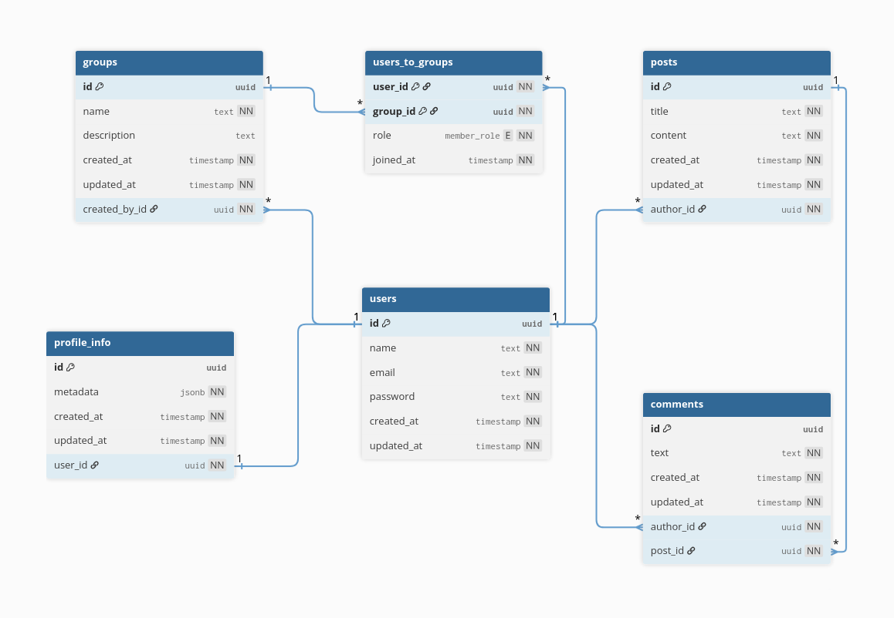

[TYPESCRIPT__BADGE]: https://img.shields.io/badge/typescript-D4FAFF?style=for-the-badge&logo=typescript
[NESTJS__BADGE]: https://img.shields.io/badge/nestjs-E0234E?style=for-the-badge&logo=nestjs
[DRIZZLE__BADGE]: https://img.shields.io/badge/drizzle-C5F74F?style=for-the-badge&logo=drizzle&logoColor=black
[JWT__BADGE]: https://img.shields.io/badge/JWT-black?style=for-the-badge&logo=JSON%20web%20tokens
[POSTGRES__BADGE]: https://img.shields.io/badge/postgres-%23316192.svg?style=for-the-badge&logo=postgresql&logoColor=white
[DOCKER__BADGE]: https://img.shields.io/badge/docker-%230db7ed.svg?style=for-the-badge&logo=docker&logoColor=white
[BCRYPT__BADGE]: https://img.shields.io/badge/bcrypt-4A4A55?style=for-the-badge&logo=npm
[SWAGGER__BADGE]: https://img.shields.io/badge/-Swagger-%23Clojure?style=for-the-badge&logo=swagger&logoColor=white

![TypeScript][TYPESCRIPT__BADGE]
![NestJS][NESTJS__BADGE]
![Drizzle ORM][DRIZZLE__BADGE]
![JWT][JWT__BADGE]
![PostgreSQL][POSTGRES__BADGE]
![Docker][DOCKER__BADGE]
![Bcrypt][BCRYPT__BADGE]
![Swagger][SWAGGER__BADGE]

---

📝 **Note:** Full documentation including API endpoints and Swagger integration is currently being written.

## Database Schema

📝 **Note:** Database schema is currently being refined and is subject to change.

